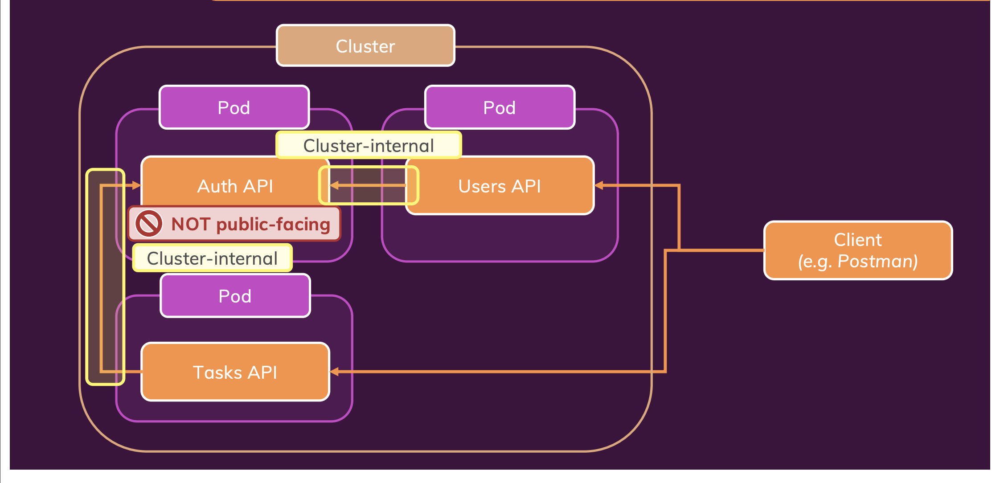

## Overview

This sample repo contains the source code for a bunch of dummy apps communicating with each other. The repo also contains the source code for the kubernetes objects required to deploy these apps/services on a kubernetes cluster.

## Images

Below images are already pushed and publicly available on DockerHub

- mohammedsunasra13/k8-3tier-demo-auth-app:v1 - Contains source code for the auth app located in the auth-api folder
- mohammedsunasra13/k8-3tier-demo-users-app:v1 - Contains source code for the users app located in the users-api folder
- mohammedsunasra13/k8-3tier-demo-tasks-app:v2 - Contains source code for the tasks app located in the tasks-api folder

## Architecture

1. The Users API/Service will be accessible from outside the cluster
2. The Auth API/Service will not be accessible from outside the cluster as it's an internal only service only used by the applications for authentication
3. The tasks API/Services will be accessible from outside the cluster
